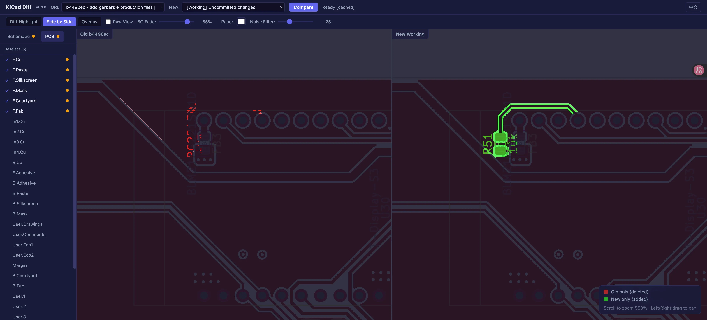

# KiCad Diff Plugin

English | [中文](README.zh-CN.md)

A visual diff plugin for KiCad 9 — compare git revisions of `.kicad_sch` / `.kicad_pcb` files in your browser.

## Features

- Automatically discovers schematic and PCB files for the current project
- Three viewing modes:
  - **Diff Highlight** — Annotates changes on a single canvas: deleted content in red, added content in green, unchanged areas faded out
  - **Side by Side** — Displays old and new versions in left/right panes with per-side annotations (red left, green right) and synchronized pan/zoom
  - **Overlay** — Blends both versions with adjustable opacity; drag the slider to transition between old and new to spot changes intuitively
- WebGL GPU-accelerated rendering for smooth pan and zoom even on large schematics and PCBs
- Smart dominant-color detection to suppress false-positive diffs from large filled areas
- Adjustable diff sensitivity and overlay opacity
- Bilingual UI (English & Chinese) with automatic browser language detection
- Content-hash caching — unchanged files are skipped during export, speeding up repeated comparisons

## Prerequisites

- KiCad 9.0+ (the `kicad-cli` command-line tool is required)
- Python 3.10+
- git (the project directory must be a git repository)

## Installation

### Recommended: Install via KiCad PCM

1. Open KiCad and click **Plugin and Content Manager** on the main screen
2. In the Plugin and Content Manager window, click the **Manage...** button (top right)
3. In the Manage Repositories dialog, click the **+** button to add a new repository:
   - **URL**: `https://raw.githubusercontent.com/Dcatfly/kicad-diff-plugin/pcm-repo/repository.json`
4. Click **Save**
5. Back in the Plugin and Content Manager, select **Dcatfly KiCad Plugins** from the repository dropdown
6. Find **KiCad Diff Plugin** in the plugins list and click **Install**
7. Click **Apply Pending Changes** to complete the installation

Installing via PCM ensures you receive future updates automatically.

### Manual Installation

1. Download the latest zip from [Releases](https://github.com/Dcatfly/kicad-diff-plugin/releases)
2. In KiCad, open the **Plugin and Content Manager**
3. Click **Install from File...** (bottom left) and select the downloaded zip
4. Click **Apply Pending Changes** to complete the installation

> **Note**: Manually installed plugins do not update automatically. You will need to download and reinstall new versions manually.

## Usage

1. Open KiCad PCB Editor
2. Click the  button on the toolbar
3. The plugin starts a local server and opens the diff viewer in your browser
4. Select a file from the left sidebar, then choose two git revisions to compare at the top

## License

[GPL-3.0](LICENSE)
