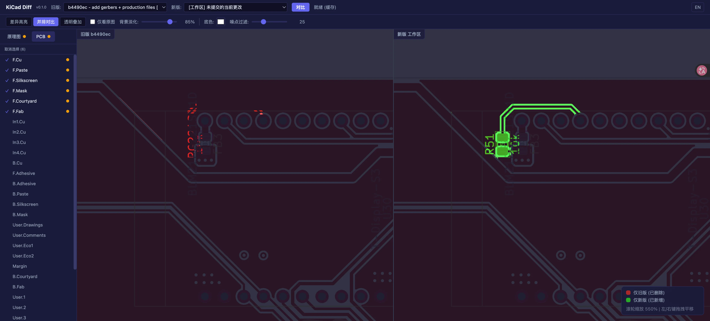

# KiCad Diff Plugin

[English](README.md) | 中文

KiCad 9 可视化差异插件 — 在浏览器中比较 `.kicad_sch` / `.kicad_pcb` 文件的 git 历史版本。

## 功能特性

- 自动发现当前项目的原理图和 PCB 文件
- 三种查看模式：
  - **差异高亮** — 在单张画布上同时标注新旧版本的变化，删除的内容用红色高亮，新增的内容用绿色高亮，未变更区域自动淡化
  - **并排对比** — 左右分栏同时显示新旧版本，各自标注本侧的变化（左红右绿），支持同步平移缩放
  - **透明叠加** — 将两个版本以可调透明度叠加显示，通过拖动滑块在新旧版本之间渐变过渡，直观观察变化区域
- WebGL GPU 加速渲染，大尺寸原理图和 PCB 也能流畅缩放平移
- 智能主色检测，忽略大面积填充区域的误报差异
- 可调节差异灵敏度和叠加透明度
- 中英双语界面，自动检测浏览器语言
- 内容哈希缓存，未变更的文件自动跳过导出，加速重复比较

## 前置要求

- KiCad 9.0+（需要 `kicad-cli` 命令行工具）
- Python 3.10+
- git（项目目录须为 git 仓库）

## 安装

### 推荐：通过 KiCad PCM 安装

1. 打开 KiCad，在主界面点击 **扩展内容管理器**
2. 在扩展内容管理器窗口中，点击右上角的 **管理...** 按钮
3. 在管理仓库对话框中，点击 **+** 按钮添加新仓库：
   - **URL**：`https://raw.githubusercontent.com/Dcatfly/kicad-diff-plugin/pcm-repo/repository.json`
4. 点击 **保存**
5. 返回扩展内容管理器，从仓库下拉列表中选择 **Dcatfly KiCad Plugins**
6. 在插件列表中找到 **KiCad Diff Plugin**，点击 **安装**
7. 点击 **应用挂起的更改** 完成安装

通过 PCM 安装可自动接收后续版本更新。

### 手动安装

1. 从 [Releases](https://github.com/Dcatfly/kicad-diff-plugin/releases) 下载最新 zip
2. 打开 KiCad，进入 **扩展内容管理器**
3. 点击左下角的 **从文件安装...** 按钮，选择下载的 zip 文件
4. 点击 **应用挂起的更改** 完成安装

> **注意**：手动安装的插件不会自动更新，需要手动下载新版本重新安装。

## 使用

1. 打开 KiCad PCB Editor
2. 点击工具栏上的  按钮
3. 插件自动启动本地服务器并在浏览器中打开差异面板
4. 在左侧边栏选择文件，在顶部选择要比较的两个 git 版本

## 许可证

[GPL-3.0](LICENSE)
